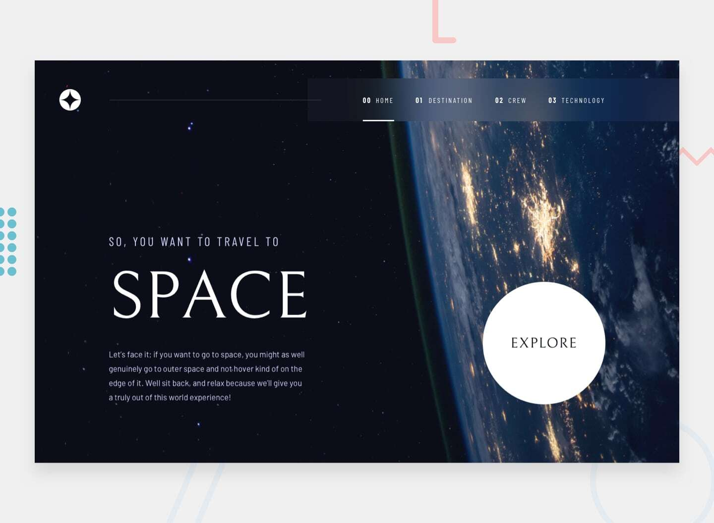

# Space Tourism Website

A modern, responsive space tourism website built with Next.js, TypeScript, and Tailwind CSS. Features interactive destination selection, crew profiles, and technology showcases with smooth animations.



## Features
- **Responsive Design**: Pixel-perfect layouts for mobile, tablet, and desktop
- **Interactive Navigation**: Smooth page transitions and dynamic routing
- **Destination Explorer**: Interactive planet selection with detailed information
- **Crew Carousel**: Meet the team with dot navigation
- **Technology Showcase**: Numbered tabs with responsive imagery
- **Modern Animations**: Framer Motion powered transitions
- **Type Safety**: Full TypeScript implementation
- **Performance Optimized**: Next.js with static generation

## Tech Stack

- **Framework**: Next.js (App Router)
- **Language**: TypeScript
- **Styling**: Tailwind CSS
- **Animations**: Framer Motion
- **Fonts**: Google Fonts (Bellefair, Barlow, Barlow Condensed)
- **Images**: Next.js Image optimization
- **Deployment Ready**: Static site generation

## Getting Started

### Prerequisites

- Node.js 18+ 
- npm or yarn

### Installation

1. Clone the repository
```bash
git clone [your-repo-url]
cd space-tourism-website
```

2. Install dependencies
```bash
npm install
```

3. Add your assets to `public/assets/` following this structure:
```
public/assets/
├── home/
│   ├── background-home-mobile.jpg
│   ├── background-home-tablet.jpg
│   └── background-home-desktop.jpg
├── destination/
│   ├── background-destination-*.jpg
│   ├── image-moon.png
│   ├── image-mars.png
│   ├── image-europa.png
│   └── image-titan.png
├── crew/
│   ├── background-crew-*.jpg
│   └── image-[crew-member].png
├── technology/
│   ├── background-technology-*.jpg
│   ├── image-launch-vehicle-portrait.jpg
│   ├── image-space-capsule-portrait.jpg
│   └── image-spaceport-portrait.jpg
└── shared/
    └── logo.svg
```

4. Start the development server
```bash
npm run dev
```

Open [http://localhost:3000](http://localhost:3000) to view the website.

## Pages

- **Home** (`/`) - Hero section with space exploration intro
- **Destinations** (`/destination`) - Interactive planet selection
  - `/destination/moon` - Moon details
  - `/destination/mars` - Mars details  
  - `/destination/europa` - Europa details
  - `/destination/titan` - Titan details
- **Crew** (`/crew`) - Team carousel with member profiles
- **Technology** (`/technology`) - Space technology showcase

## Key Features

### Responsive Design
- Mobile-first approach with breakpoints at 768px and 1024px
- Adaptive layouts and typography scaling
- Touch-friendly navigation on mobile devices

### Interactive Elements
- Planet selection tabs with smooth transitions
- Crew member carousel with dot navigation
- Technology numbered tabs with portrait/landscape images
- Hover effects and micro-interactions

### Performance
- Next.js Image optimization for all assets
- Static site generation for fast loading
- Optimized font loading with Google Fonts
- Lazy loading for images and components

### Accessibility
- Semantic HTML structure
- ARIA labels for interactive elements
- Keyboard navigation support
- High contrast design for readability

## Customization

### Adding New Destinations
1. Add data to `src/data/destinations.json`
2. Add corresponding images to `public/assets/destination/`
3. The routing will be automatically generated

### Modifying Styles
- Global styles: `src/app/globals.css`
- Tailwind config: `tailwind.config.ts`
- Component-specific styles: Use Tailwind utility classes

### Animations
All animations use Framer Motion. Customize in individual components:
- Duration and easing in motion variants
- Stagger delays for sequential animations
- Custom transitions for specific elements

## Build & Deployment

```bash
# Build for production
npm run build

# Start production server
npm start

# Export static site
npm run build && npm run export
```

The site is optimized for static hosting on platforms like:
- Vercel
- Netlify
- GitHub Pages
- AWS S3

## Browser Support

- Chrome 90+
- Firefox 88+
- Safari 14+
- Edge 90+

## Contributing

1. Fork the repository
2. Create a feature branch (`git checkout -b feature/new-feature`)
3. Commit changes (`git commit -am 'Add new feature'`)
4. Push to branch (`git push origin feature/new-feature`)
5. Open a Pull Request

## License

This project is licensed under the MIT License - see the [LICENSE](LICENSE) file for details.

## Acknowledgments

- Design inspiration from space exploration websites
- Typography from Google Fonts
- Icons and imagery optimized for web performance